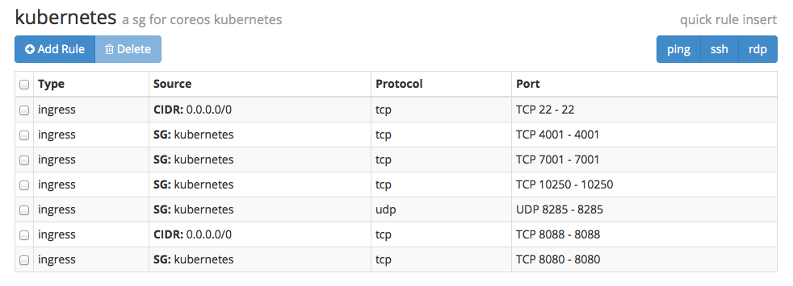

# kubernetes-exoscale

A tutorial to run Kubernetes on [CloudStack](http://cloudstack.apache.org) using [exoscale](http://www.exoscale.ch) as a Cloud provider. It is based on Kelsey Hightower [tutorial](https://github.com/kelseyhightower/kubernetes-fleet-tutorial). This tutorial walks you through creating an [etcd](https://github.com/coreos/etcd) cluster and a [kubernetes](https://github.com/GoogleCloudPlatform/kubernetes) cluster. Both clusters run within their own security group.

# Introduction

Kubernetes is a [docker](http://docker.io) management platform open sourced by Google. It aims at making application management scalable, fault tolerant and easy. It provides replication and proxy services. Kubernetes can be deployed on any set of machines that supports docker. CoreOS is a new linux distribution that offers rolling upgrade and is customized for running docker applications and managing distributed systemd services. The availibility of a CoreOS template on exoscale makes it extremely simple to deploy Kubernetes there and shows how Kubernetes can run on CloudStack.

## Exoscale

[exoscale](http://www.exoscale.ch) is a swiss cloud provider based on [Apache CloudStack](http://cloudstack.apache.org), it is setup in a similar fashion than Amazon EC2 and provides virtual machine instances in various flavors including [CoreOS](http://coreos.com). Access to the instances is via ssh using key pairs and network isolation is done through security groups. To go through this tutorial you will need to [sign-up](https://portal.exoscale.ch/register) and go through some of the getting started [guides](https://community.exoscale.ch/compute/tutorials/getting-started/).

## Apache CloudStack

While this tutorial is specific to exoscale it can be applied to any other CloudStack clouds, as long as a CoreOS template is made available to the users. There are other ways to install Kubernetes on CloudStack, via [Vagrant](http://www.vagrantup.com) using the vagrant-cloudstack plugin, using the salt recipes available in Kubernetes or writing your own recipes for Ansible, Chef etc. 

## CoreOS

CoreOS is a new linux distribution aimed at scalable deployments and docker support. It offers rolling upgrade and a minimal install, with the particularity of having etcd and [fleet](https://coreos.com/using-coreos/clustering/) installed. Fleet allows you to manage systemd based services on a cluster of machines, in this tutorial we will install Kubernetes through systemd services and launch them with fleet. Etcd is a distributed key value store that can be used for service discovery.

# Getting started

This tutorial is composed of four steps:

* Creating the security groups on exoscale
* Creating an ETCD cluster
* Creating a KUBERNETES cluster
* Launching the KUBERNETES services

## Creating the security groups and a key pair on exoscale

We will launch one ETCD cluster (three nodes) and one KUBERNETES cluster (three nodes). Each cluster will be in its own security group: etcd and kubernetes.

Follow the [guide](https://community.exoscale.ch/compute/tutorials/firewall/introduction-to-security-groups/) and create the two security groups. They should have the following rules

Etcd security group:


Kubernetes security group:



[Create](https://community.exoscale.ch/compute/tutorials/getting-started/ssh-keypairs/) a keypair and save the private key locally.

## Bootstrapping the etcd cluster

To ease the bootstrapping of our etcd cluster we are going to use the CoreOS discovery service (really an existing etcd cluster :) ).
You can learn more about the [discovery protocol](https://github.com/coreos/etcd/blob/master/Documentation/discovery-protocol.md) including setting up your own discovery service.

Start by grabbing a new discovery token:

```
curl -w "\n" https://discovery.etcd.io/new
```

And edit the `nodes/etcd.yml` to replace the <token> with it.

Our deployment process will use two [cloud config](https://coreos.com/docs/cluster-management/setup/cloudinit-cloud-config/) scripts located in `nodes/` and very similar to the EC2 [scripts](https://coreos.com/docs/running-coreos/cloud-providers/ec2/). This is not suprising as exoscale aims to mimic EC2 and supports [userdata](https://community.exoscale.ch/compute/tutorials/automation/bootstrap-your-instances-with-cloudinit-and-user-data/).

The `deploy` directory contains two python scripts that use libcloud to start the instances.
Install [libcloud](http://libcloud.apache.org):

```
sudo pip install apache-libcloud
```

Store your API keys from exoscale as environment variables:

```
export EXOSCALE_API_KEY=<api key>
export EXOSCALE_SECRET_KEY=<secret key>
```

Then execute the deployment script:

```
python ./deploy/etcd.py
```

Once the script finished you should see three CoreOS instances in the exoscale dashboard. SSH to one of the instance using your ssh keypair and the core user.
Then execute `fleetctl list-machines` and you should see something similar to:

```
$ fleetctl list-machines
MACHINE		IP		METADATA
1745a36f...	185.19.28.164	role=etcd
34399153...	185.19.28.129	role=etcd
3cd468ed...	185.19.28.191	role=etcd
```

## Creating the Kubernetes cluster

Take one of the IP addresses of your etcd cluster nodes and edit the `nodes/knode.yml` file to replace <ip> with it.

Execute the deployment script to start 5 kubernetes nodes:

```
python ./deploy/kube.py
```

And on one of your etcd or kubernetes machines you should now see:

```
$ fleetctl list-machines
MACHINE		IP		METADATA
11deb0be...	185.19.28.224	role=kubernetes
1745a36f...	185.19.28.164	role=etcd
3424fd8d...	185.19.28.207	role=kubernetes
34399153...	185.19.28.129	role=etcd
3cd468ed...	185.19.28.191	role=etcd
6ce6b544...	185.19.28.211	role=kubernetes
d9803976...	185.19.28.201	role=kubernetes
db72da3e...	185.19.28.229	role=kubernetes
```

At this stage, there might be an issue with FLEETCTL_ENDPOINT not being set on the kubernetes nodes. This prevents you from running `fleetctl` on those nodes.
This is under investigation.

## Launching the Kubernetes services

All the systemd services needed to run Kubernetes are located in the `./units` directory.


